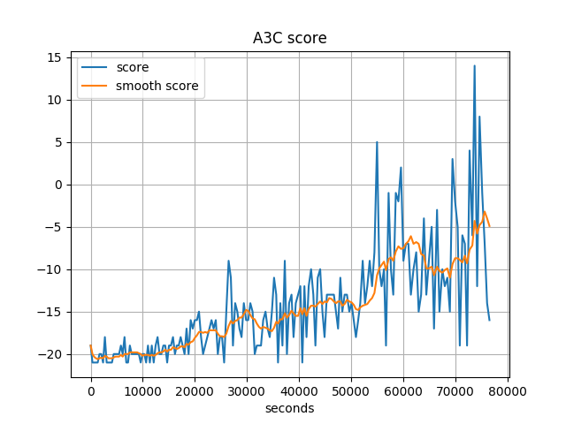
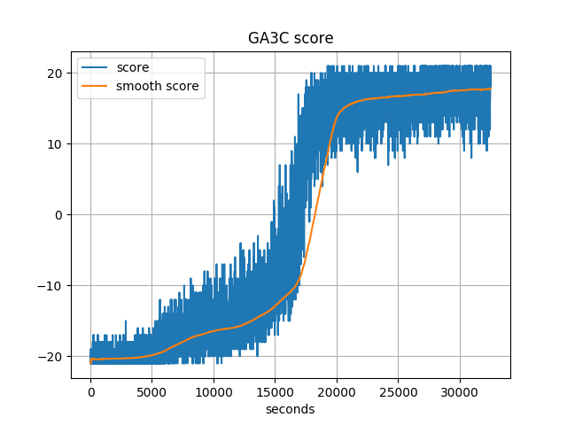
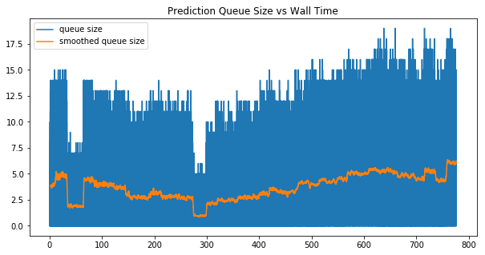
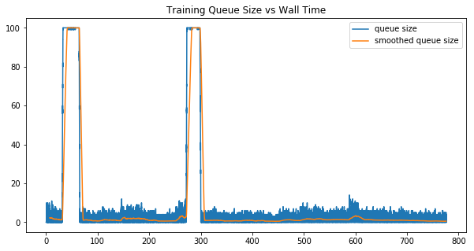

# Multiverse Reinforcement Learning
by Bo Chen, Bowen Deng

-----
# Checkpoint
Apr 25, 2017

## Progress
By checkpoint, we have succeeded to run two baselines of the project using public repository:

* A3C[1]: [https://github.com/dennybritz/reinforcement-learning](https://github.com/dennybritz/reinforcement-learning)
* GA3C[2]: [https://github.com/NVlabs/GA3C](https://github.com/NVlabs/GA3C)

A few changes are made to the code to make the two methods directly compatible. In short, GA3C is the GPU speed up version of A3C. The key metric to evaluate the perfomance is PPS, predictions per second. This metric evaluates the speed at which the agent explores the new environment, it can be roughly understood as new frames seen per second, thus a higher metric is better. When both approaches use 16 threads for agents, GA3C's PPS is 448, A3C's PPS is 155, so a speedup of 448 / 155 = 2.89x is achieved.

Regarding the learning curve, we show the learning curve for both A3C and GA3C below. The curves are not directly comparable here: GA3C uses up to 57 threads for agents, because of its dynamic scheduling; while A3C keeps using 16 threads. Nevertheless, we see A3C doesn't converge after 80000 seconds, while GA3C converges in roughly 20000 seconds. So GA3C does speed up A3C because of the utilization of GPU.

We inspected the size of different work queues during training. An ideal scheduling would keep the size of queue stable around some non-zero value. If the queue is always empty, it means that workers don't get enough workload to do. If the queue is always growing, it means that clients yield too much workload beyond the workers' capability. 

GA3C introduced a random scheduling policy, it randomly allocates a new worker/client or deletes an existing worker/client periodically, then compares the throughput before and after the tuning. If the throughput goes bad, it will rollback to previous setting. However, we noticed that such scheduling policy is not very effective. As we saw in the plots below:

The size of prediction queue and training queue oscillates from time to time, indicating the random search policy can unnecessarily disturb the stability of the throughput.

## Updated Schedule
After reading and analyzing the performance of the code, we propose the following improvements:

1. Improve the dynamic scheduling: Currently the scheduling is based on annealing process, it randomly perturbs the number of agents, predictors, and trainers every minute, and accepts the new configuration if it leads to a better performance. We plan to try both rule based scheduling and heuristic search, rather than random search;
2. Latency hiding on the CPU (agent) side: Now once a request is sent from the CPU to GPU, the agent just blocks and waits for the request to complete. This results in low utilization of CPU resources and low data feeding rate to GPU. A better way is to let each thread has its own emulation environment pool, and switch emulation enviroment when one stalls.
3. Replay memory for GPU: the idea of replay memory is to keep GPU busy when CPU fails to generate enough data for GPU to consume at some time. Keeping GPU busy and learning from replay memory helps the algorithm to converge faster.

Our new schedule is based on the proposed improvements:

- [x] 4.10 - 4.16 Build up the baseline from GA3C's implementation;
- [x] 4.17 - 4.23 Implement first version that compiles and runs, no optimization trick is added this stage;
- [ ] by April 30, we will implement proposal 1;
- [ ] by May 7, we will implement proposal 2 and 3;
- [ ] in the last week, we will analyze the performance and summarize the project;

## Goals and deliverables
Our primary goal is to still outperform GA3C in speeding up A3C. We believe this is achievable based on the above analysis. 

The deliverable will still be trained agents playing games, comparison between learning curves and PPS.

## Issue

Computation resource is the main limit. We are currently using bridges cluster of Pittsburgh Supercomputing Center. The cluster is quite busy these days, so we often need to wait for hours before running the code.

-----
# Proposal
Apr 10, 2017

## Summary
In this project, we plan to parallize reinforcement learning. We will use multiple CPUs to interact with multiple environments (multiverse) and one GPU to speed up the computation of neural network.

## Background
Deep neural networks provide rich expression power that can enable reinforcement learning (RL) algorithms to perform effectively. However, unlike traditional supervised learning or unsupervised learning tasks, there is no fixed training dataset for reinforcement learnning tasks. The model needs to constantly interact with environment during training stage to adjust itself. 

Also, since the transitions are often correlated with each other in time. The gradient descent learning can be unstable. To address this problem experience replay was introduced: when training the network, transitions which are randomly sampled from the replay memory are used instead of the most recent transitions. Such technique breaks the correlation of subsequent training samples. But still the network need to interact with the environment to keep the transitions in replay memory updated. Also, since the sampled transitions might not be generated by the latest policy, such gradient could be noisy with respect to current model configuration. 

An asynchronous RL framework was proposed: asynchronous training of reinforcement learning agents in a multi-threading setting. Each thread maintains an independent episode with the target enviroment, and different episodes running in parallel are likely to be exploring different parts of the enviroment. Such diversity can reduce the correlation among training samples. Thus, the replay memory could be removed from training algorithm. Such framework obtains a reduction in training time that is roughly linear in the number of parallel learners, and achieves state-of-the-art results on many gaming tasks. 

Later on, a hybrid CPU/GPU version of the Asynchronous Advantage ActorCritic (A3C) algorithm was proposed, it added a system of queues to batch data - to obtain higher learning throughput on a GPU, which leads to a reduction in traning time without losing any performance. However, the computation power of the system is still not fully utilized. Especially for the CPU, there is significant latency overhead spent accumulating the batch and retrieving the prediction result, so it remains idle most of time.

We plan to enable running multiple episodes on each thread, and switch between different episodes during waiting for the prediction results. By doing this, we could increase the throughtput of CPU and hide the latency for each interaction. Also, we will investigate different balancing policy for the batch queue, in order to get a higher GPU utilization.

## Challenge
Potential challenges include:

* We are building a heterogeneous system involving multiple CPUs and GPUs. Therefore, we need to consider problems such as synchronization, work balance, minizing data transfer between CPU and GPU.
* GPU have two different work queues due to the nature of different works. The learning algorithm requires these two queues to be consumed at an approximate proportional rate. To dynamically schedule between queues and maximize throughput in the meantime is a difficult task.
* We also need to maximize the throughput of CPU. But there is an interdependency between CPU and GPU work, which further compliates this problem.

## Resources
Our project is mainly based on two papers, A3C[1] and GA3C[2]. The code of GA3C is made public on github, [https://github.com/NVlabs/GA3C](https://github.com/NVlabs/GA3C). We will compare the result of our projects with GA3C. The ideal platform is multiple core CPUs with one beefy GPU. 

## Goals/Deliverables
* The key metrics of this project are training per second (TPS) and prediction per second (PPS). In terms of these two metrics, Our conservative goal is to achieve a 4x speed up. Such a speed up is achievable as GA3C[2] already achieved this number.
* We hope to achieve an 8x speedup for these two metrics. GA3C achieves a 4x speedup with 43% GPU thread utiliazation. In theory, if GPU is fully utilized, we should be able to further speed up the system to roughly 8x.
* This project is to parallize a reinforcement learning algoithm. Hence the learning outcome also matters greatly here. Therefore, our demo will include the video captures of the learned agent playing games. 

## Platform
Emulators only run on CPUs and GPU is needed to speedup the computation of neural network. We will use TensorFlow for the project because it saves us from the burden of neural network related tasks, and helps us to focus on the parallizing part. Moreover, the open source implementation of GA3C also used TensorFlow for neural network computation, it would be convenient to compare the performance by adopting same neural network implementation.

# Schedule
* 4.10 - 4.16 Build up the baseline from GA3C's implementation;
* 4.17 - 4.23 Implement first version that compiles and runs, no optimization trick is added this stage;
* 4.24 - 4.30 Add optimization tricks such as work balancing, queue scheduling to the implementation;
* 5.01 - 5.07 Experiment and identify the bottlenecks, and further optimize if possible;
* 5.08 - 5.12 Wrap up the project and write report;

## References
[1] Mnih, Volodymyr, et al. "Asynchronous methods for deep reinforcement learning." International Conference on Machine Learning. 2016.

[2] Babaeizadeh, Mohammad, et al. "GA3C: GPU-based A3C for Deep Reinforcement Learning." arXiv preprint arXiv:1611.06256 (2016).

